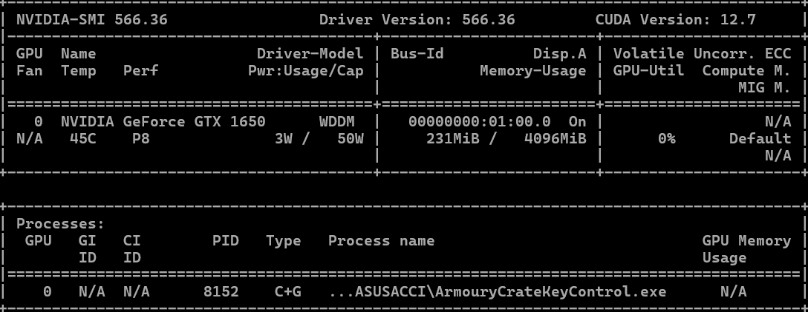
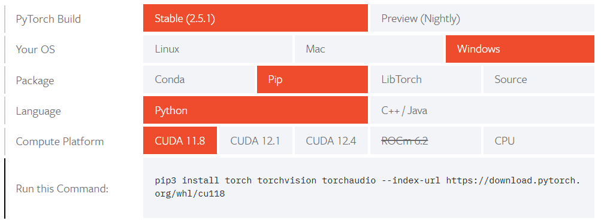
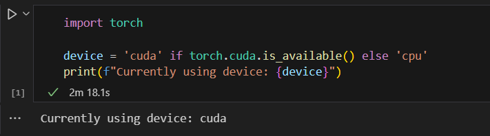

# Setup NVIDIA GPU for Deep Learning
__This instruction is for Windows users.__ 

## Step 1: Download NVIDIA Video Driver
If this already exist then skip this step or, try to update to latest version.
Download and install the NVIDIA App, then download and install the latest driver.
- [NVIDIA Video Driver](https://www.nvidia.com/en-us/software/nvidia-app/)

## Step 2: Download Visual Studio C++
Visual Studio with C++ installed is need. CUDA and cuDNN needs C compiler in our OS to run particular GPU. By default we don't get C compiler 
in our system, we manually need to install it.

- [Visual Studio Community Edition](https://visualstudio.microsoft.com/vs/community/)

Now select the required options from `Compilers, build tools, and runtimes`. After downloading PC needs to restart. Then to verify whether
installed or not, check C drive go to: `Program Files` -> `Microsoft Visual Studio` -> `Community` -> You will see files.

## Step 3: Download and Install Anaconda/Miniconda:
Miniconda is clean and efficient than Anaconda. In Miniconda, we download the required packages manually and also maintain dependencies, where
in Anaconda all the packages are installed already. Sometimes this leads to dependency issues.

- [Anaconda Download](https://www.anaconda.com/download)

## Step 4: CUDA Toolkit:
Download and Install CUDA Toolkit now.
- [Download CUDA Toolkit]()
After going to this link, you will see many versions of CUDA. Now to install the compatible and right version check your GPU configs.
Open Command Prompt and then check the GPU:
```
nvidia-smi 
```
Then you will see GPU model, Driver Version, and CUDA Version.



I have CUDA version 12.7. But there we again need to check another thing, go to `TensorFlow` or, `PyTorch`. And check which versions is currently available.

__For PyTorch__: Go to,
[Start Locally PyTorch](https://pytorch.org/get-started/locally/). Here we can see, these versions are available. But an average one, neither too old nor too latest.



 I will go for 12.4 version. Now go back to the CUDA Toolkit website and download the version. Now choos your current OS setting and download. Then install the CUDA Toolkit. For installation option: Select `Express` option.
 
 ___If you face some errors during installation, then restart your PC and try again___
 
 __To verify whether, installed or not go to:__ `C drive` -> `Program Files`
 -> `NVIDA GPU Computing Toolkit` -> you will CUDA and it's versions

## Step 5: Download and Setup cuDNN:
Go to this link:

[Download cuDNN](https://developer.nvidia.com/rdp/cudnn-archive)

As we have downloaded and installed version `v.12.__`. Select `CUDA 12.x`.
Then select the `Local Installer`. It will download a `zip file`. Then `unzip` it.
After `unzipping` you will see, `bin`, `include`, `lib`, etc folders.

Now Do these steps:
1. Go to C drive and navigate to: `Program Files` -> `NVIDIA GPU Computing Toolkit`
-> `CUDA`.
    - Copy all the files inside bin folder from `cudnn-windows-x86_64-8.9.7.29_cuda12-archive/bin` to the `CUDA/bin` folder.

    - Do same for `include`, and `lib` folders.

2. Check the `Environment Path Variable` and check if `CUDA_PATH` and `CUDA_PATH_V12_x` included or not. If included all done, if not then
there may have issues with your installation process OR `YOU CAN DO THIS DOING MANUALLY`.

## Install PyToch:
Install PyToch, Go to:

[Install PyTorch](https://pytorch.org/get-started/locally/)

Then select the version you download, and copy and run command: 

`pip3 install torch torchvision torchaudio --index-url https://download.pytorch.org/whl/cu124`

As I have installed `CUDA 12.4` that's why, `./whl/cu124` is showing.

## Verify Installation:
To verify whether GPU connected or not, use this code in your notebook. Open `VScode` or other IDE you are using:
```
import torch

device = 'cuda' if torch.cuda.is_available() else 'cpu'
print(f"Currently using device: {device}")
```

If you see this output:

__Currently Using Device: cuda__

then you GPU setup is successful. 🫠 Here is an output:

