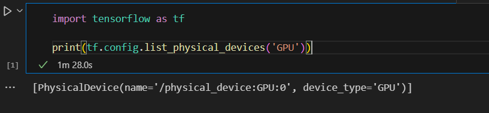

# Setting Up NVIDIA GPU for Deep Learning(TensorFlow) on Windows:

Make sure you install all the necessary things: `CUDA`, `cuDNN`, `Visual Studio with C++`, `Install Miniconda/Anaconda`, `Done all the enviroment path setting`.
I have mentioned all these in `GPU_setup.md` file.

## Setup TensorFlow GPR:
1. Create an environment using `Anaconda Command Prompt`. Like this, I am naming `tensorflow_env`.
```
conda create -n tensorflow_env python=3.8
```

Python version must be 3.8.

2. Activate the environment.
```
conda activate tensorflow_env
```

3. Run these commands.
```
conda config --add channels conda-forge
conda config --set channel_priority strict
```

4. Install CUDA Toolkit and cuDNN specific version.
```
conda install cudatoolkit=11.2 cudnn=8.1 -c conda-forge
```

5. Install TensorFlow GPU version 2.10.
```
pip install tensorflow-gpu=2.10
```

6. Run this code in your notebook and verify the installation. [__Make sure you set kernel to your environment name__]
```
import tensorflow as tf

print(tf.config.list_physical_devices('GPU'))
```

7. You will get an output like this:



_Congratulations you have installed TensorFlow GPU_